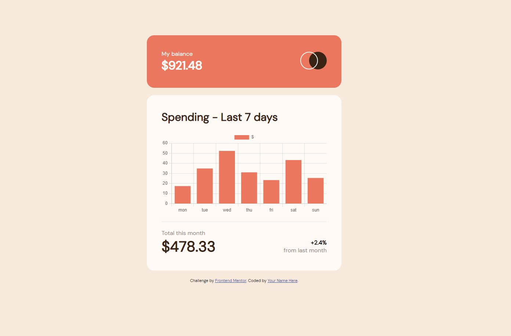

# Frontend Mentor - Expenses chart component solution

This is a solution to the [Expenses chart component challenge on Frontend Mentor](https://www.frontendmentor.io/challenges/expenses-chart-component-e7yJBUdjwt). Frontend Mentor challenges help me improve my coding skills by building realistic projects. 

## Table of contents

- [Overview](#overview)
  - [The challenge](#the-challenge)
  - [Screenshot](#screenshot)
  - [Links](#links)
- [My process](#my-process)
  - [Built with](#built-with)
  - [What I learned](#what-i-learned)
  - [Continued development](#continued-development)
  - [Useful resources](#useful-resources)
- [Author](#author)
- [Acknowledgments](#acknowledgments)

**Note: Delete this note and update the table of contents based on what sections you keep.**

## Overview

### The challenge

- View the bar chart and hover over the individual bars to see the correct amounts for each day
- See the current day’s bar highlighted in a different colour to the other bars
- View the optimal layout for the content depending on their device’s screen size
- See hover states for all interactive elements on the page
- **Bonus**: Use the JSON data file provided to dynamically size the bars on the chart

### Screenshot



Here the look of the project I am done, not totally copy because of the chart, but I am happy what I am done usung chart js.

### Links

- Live Site URL: [Expenses-chart-component](https://kramligcoder.github.io/Expenses-chart-component)

## My process

### Built with

- Semantic HTML5 markup
- CSS custom properties
- Flexbox
- CSS Grid
- Mobile-first workflow
- [Chart js Library](https://www.chartjs.org/) - For Chart look

### What I learned

This is what I learn for this test project, to know how to use the chart js. I know this is not a 100% look like in the project but I am happy what they look. I hope new time I can manually code using the data json given.

To see how you can add code snippets, see below:

```html
<div>
  <canvas id="m_Chart"></canvas>
</div>
```
```js
const ctx = document.getElementById('m_Chart');

new Chart(ctx, {
  type: 'bar',
  data: {
    labels: ['mon', 'tue', 'wed', 'thu', 'fri', 'sat', 'sun'],
    datasets: [{
      label: '$',
      data: [17.45, 34.91, 52.36, 31.07, 23.39, 43.28, 25.48],
      backgroundColor: "hsl(10, 79%, 65%)"
    }]
  },
  options: {
    scales: {
      y: {
        beginAtZero: true
      }
    }
  }
});
```

### Continued development

I will continue this opportunity to learn more and echance more my skill and knowledge. I am really enjoy doing this test project.

### Useful resources

- [W3 Schools](https://www.w3schools.com/) - W3 schools really helping me a lot doing this project, to find solution how the code really work.
- [Stack Overflow](https://stackoverflow.com/) - This is really help when I am stuck something.
- [Chart Js](https://www.chartjs.org/) - At this moment this help me create right away chart.

## Author

- Website - [Mark Gil Sumanlad](https://kramligcoder.github.io/MarkGilSumanlad/index.html) - Maybe next time I will update and change the look of my static portfolio.
- Frontend Mentor - [@kramlig22](https://www.frontendmentor.io/profile/kramlig22)

## Acknowledgments

I credit this project in Frontend Mentor.
